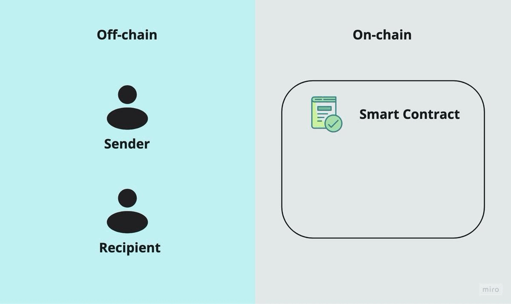

# Hiding Pot / Clover
Private transactions on Clover blockchain.

This project is fully inspired by [Tornado.cash](https://tornado.cash/) mixer.

Demo [video](https://youtu.be/GE5J1FsBY3o).

Build for [Utonhack 2021 / Clover](https://utonhack-2021.devpost.com/).

## What is it
We aim to bring private transactions to the Clover blockchain. So we have built a non-custodial on-chain privacy solution based on zkSNARKs. It breaks the on-chain link between the sender and destination address. 

## How it works
Sender, recipient, and smart contract are here:

    

1. To make a deposit, the sender generates a secret and sends its hash along with the deposit amount to the smart contract. 
2. The contract accepts the deposit and adds the hash to its list of deposits.
3. When some number of deposits is happened (anonymity set is big enough), the recipient decides to make a withdrawal. They should provide proof that they own a secret to an unspent deposit. zkSnark technology allows that to happen without revealing which exact deposit corresponds to this secret.
4. The smart contract will check the proof and transfer deposited funds to the recipient's address.

So an external observer will be unable to determine which deposit this withdrawal came from.

## Technical details
[Clover](https://clovernet.io/) smart contract is used as backend. All functionality and data are stored in the Clover blockchain.

Zk part of the project is implemented using [circom](https://github.com/iden3/circom) and [wasmsnark](https://github.com/iden3/wasmsnark) libraries. These libraries generate wasm prover and verifier which allow generating and verifying proofs in web browser effectively.

Client is the static web page which connects with the Clover blockchain using [Likelib](https://github.com/HeshuEU/likelib-hackathon).
